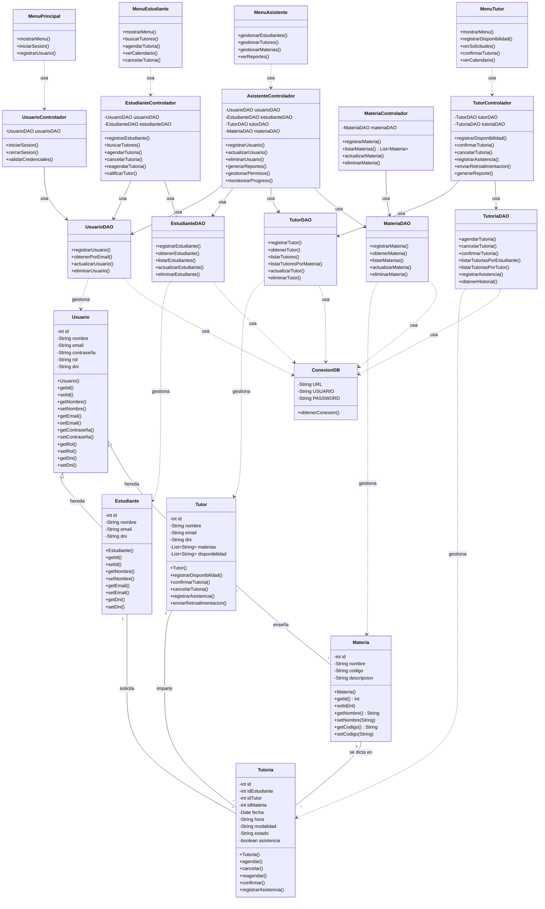

# Diagrama UML - UniTutor

## Diagrama de Clases (Dominio)

```mermaid
classDiagram
    %% Capa Modelo
    class Usuario {
        -int id
        -String nombre
        -String email
        -String contraseña
        -String rol
        -String dni
        +Usuario()
        +getId()
        +setId()
        +getNombre()
        +setNombre()
        +getEmail()
        +setEmail()
        +getContraseña()
        +setContraseña()
        +getRol()
        +setRol()
        +getDni()
        +setDni()
    }

    class Estudiante {
        -int id
        -String nombre
        -String email
        -String dni
        +Estudiante()
        +getId()
        +setId()
        +getNombre()
        +setNombre()
        +getEmail()
        +setEmail()
        +getDni()
        +setDni()
    }

    class Tutor {
        -int id
        -String nombre
        -String email
        -String dni
        -List~String~ materias
        -List~String~ disponibilidad
        +Tutor()
        +registrarDisponibilidad()
        +confirmarTutoria()
        +cancelarTutoria()
        +registrarAsistencia()
        +enviarRetroalimentacion()
    }

    class Materia {
        -int id
        -String nombre
        -String codigo
        -String descripcion
        +Materia()
        +getId() int
        +setId(int)
        +getNombre() String
        +setNombre(String)
        +getCodigo() String
        +setCodigo(String)
    }

    class Tutoria {
        -int id
        -int idEstudiante
        -int idTutor
        -int idMateria
        -Date fecha
        -String hora
        -String modalidad
        -String estado
        -boolean asistencia
        +Tutoria()
        +agendar()
        +cancelar()
        +reagendar()
        +confirmar()
        +registrarAsistencia()
    }

    %% Capa DAO
    class ConexionDB {
        -String URL
        -String USUARIO
        -String PASSWORD
        +obtenerConexion()
    }

    class UsuarioDAO {
        +registrarUsuario()
        +obtenerPorEmail()
        +actualizarUsuario()
        +eliminarUsuario()
    }

    class EstudianteDAO {
        +registrarEstudiante()
        +obtenerEstudiante()
        +listarEstudiantes()
        +actualizarEstudiante()
        +eliminarEstudiante()
    }

    class TutorDAO {
        +registrarTutor()
        +obtenerTutor()
        +listarTutores()
        +listarTutoresPorMateria()
        +actualizarTutor()
        +eliminarTutor()
    }

    class MateriaDAO {
        +registrarMateria()
        +obtenerMateria()
        +listarMaterias()
        +actualizarMateria()
        +eliminarMateria()
    }

    class TutoriaDAO {
        +agendarTutoria()
        +cancelarTutoria()
        +confirmarTutoria()
        +listarTutoriasPorEstudiante()
        +listarTutoriasPorTutor()
        +registrarAsistencia()
        +obtenerHistorial()
    }

    %% Capa Controlador
    class UsuarioControlador {
        -UsuarioDAO usuarioDAO
        +iniciarSesion()
        +cerrarSesion()
        +validarCredenciales()
    }

    class EstudianteControlador {
        -UsuarioDAO usuarioDAO
        -EstudianteDAO estudianteDAO
        +registrarEstudiante()
        +buscarTutores()
        +agendarTutoria()
        +cancelarTutoria()
        +reagendarTutoria()
        +calificarTutor()
    }

    class TutorControlador {
        -TutorDAO tutorDAO
        -TutoriaDAO tutoriaDAO
        +registrarDisponibilidad()
        +confirmarTutoria()
        +cancelarTutoria()
        +registrarAsistencia()
        +enviarRetroalimentacion()
        +generarReporte()
    }

    class MateriaControlador {
        -MateriaDAO materiaDAO
        +registrarMateria()
        +listarMaterias() List~Materia~
        +actualizarMateria()
        +eliminarMateria()
    }

    class AsistenteControlador {
        -UsuarioDAO usuarioDAO
        -EstudianteDAO estudianteDAO
        -TutorDAO tutorDAO
        -MateriaDAO materiaDAO
        +registrarUsuario()
        +actualizarUsuario()
        +eliminarUsuario()
        +generarReportes()
        +gestionarPermisos()
        +monitorearProgreso()
    }

    %% Capa Vista
    class MenuPrincipal {
        +mostrarMenu()
        +iniciarSesion()
        +registrarUsuario()
    }

    class MenuEstudiante {
        +mostrarMenu()
        +buscarTutores()
        +agendarTutoria()
        +verCalendario()
        +cancelarTutoria()
    }

    class MenuTutor {
        +mostrarMenu()
        +registrarDisponibilidad()
        +verSolicitudes()
        +confirmarTutoria()
        +verCalendario()
    }

    class MenuAsistente {
        +gestionarEstudiantes()
        +gestionarTutores()
        +gestionarMaterias()
        +verReportes()
    }

    %% Relaciones Modelo
    Usuario <|-- Estudiante : hereda
    Usuario <|-- Tutor : hereda
    Estudiante "1" -- "*" Tutoria : solicita
    Tutor "1" -- "*" Tutoria : imparte
    Materia "1" -- "*" Tutoria : se dicta en
    Tutor "*" -- "*" Materia : enseña

    %% Relaciones DAO - Modelo
    UsuarioDAO ..> Usuario : gestiona
    EstudianteDAO ..> Estudiante : gestiona
    TutorDAO ..> Tutor : gestiona
    MateriaDAO ..> Materia : gestiona
    TutoriaDAO ..> Tutoria : gestiona

    %% Relaciones DAO - Conexión
    UsuarioDAO ..> ConexionDB : usa
    EstudianteDAO ..> ConexionDB : usa
    TutorDAO ..> ConexionDB : usa
    MateriaDAO ..> ConexionDB : usa
    TutoriaDAO ..> ConexionDB : usa

    %% Relaciones Controlador - DAO
    UsuarioControlador --> UsuarioDAO : usa
    EstudianteControlador --> UsuarioDAO : usa
    EstudianteControlador --> EstudianteDAO : usa
    TutorControlador --> TutorDAO : usa
    TutorControlador --> TutoriaDAO : usa
    MateriaControlador --> MateriaDAO : usa
    AsistenteControlador --> UsuarioDAO : usa
    AsistenteControlador --> EstudianteDAO : usa
    AsistenteControlador --> TutorDAO : usa
    AsistenteControlador --> MateriaDAO : usa

    %% Relaciones Vista - Controlador
    MenuPrincipal ..> UsuarioControlador : usa
    MenuEstudiante ..> EstudianteControlador : usa
    MenuTutor ..> TutorControlador : usa
    MenuAsistente ..> AsistenteControlador : usa
```